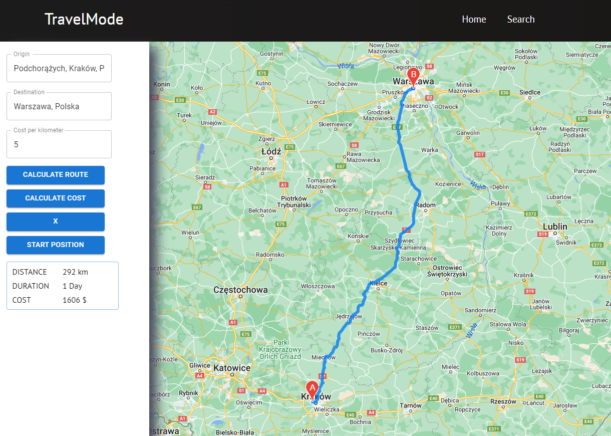

# React App with Google Maps API

## Table of contents
* [General info](#general-info)
* [Setup](#setup)
* [Available Scripts](#available-scripts)

## General info

Check how it works [here](https://wk-project-6.netlify.app)
This application was created with React.js and Google Maps API to calculate the route from point a to point b, display it on the map and calculate the time, distance and cost of reaching the destination.

To achieve this, I have used function component which contains several useState and useRef hooks. I created an asynchronous function to calculate distance and time, as well as a function to calculate cost and delete existing states. To properly handle google maps api I used a unique api key and defined variables such as directionsService and results. In addition, I created a navbar that allows you to move around the pages (I used a previously created navbar in a project called 'React-project-2' in my repo).

## Setup

1. React router DOM `npm install react-router-dom` or `$ yarn add react-router-dom`
2. Google Maps API `npm i -S @react-google-maps/api` or `yarn add @react-google-maps/api`
3. Mui Material-UI `npm install @mui/material @emotion/react @emotion/styled` or `yarn add @mui/material @emotion/react @emotion/styled`

